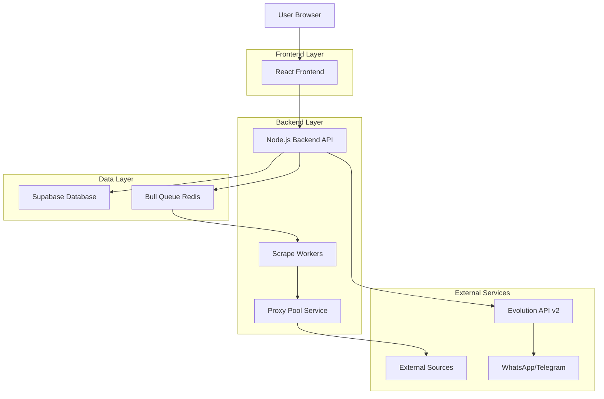
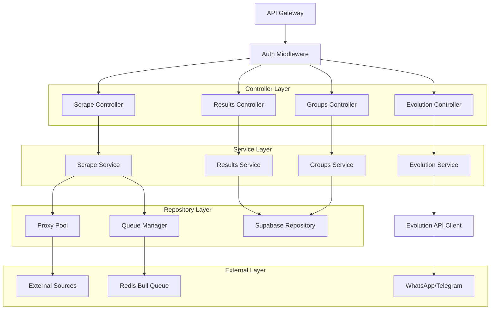
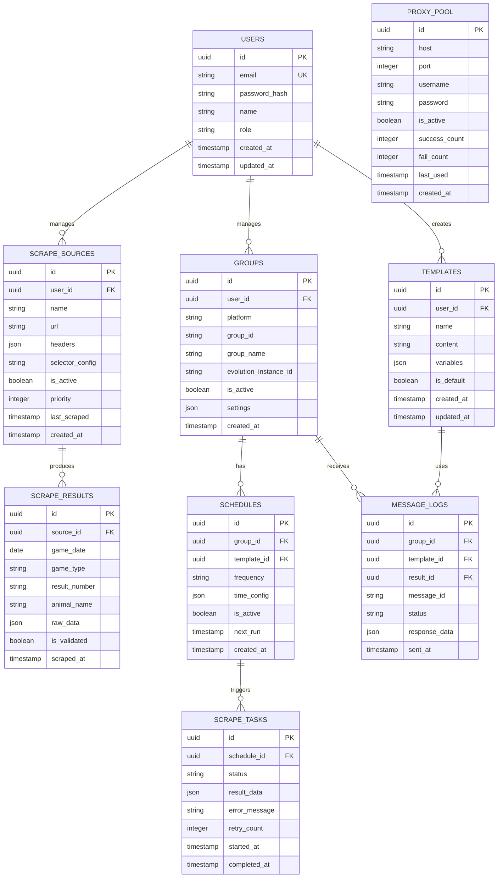

## 1.Architecture design



## 2.Technology Description

- Frontend: React@18 + TypeScript + TailwindCSS@3 + Vite
- Backend: Node.js@20 + Express@4 + TypeScript
- Database: Supabase (PostgreSQL)
- Queue System: Bull@4 + Redis
- Web Scraping: Puppeteer@21 + Cheerio
- Proxy Management: proxy-agent@6 + rotating-proxy@1
- Evolution API: REST client com axios
- Monitoramento: Winston@3 + Sentry

## 3.Route definitions

| Route | Purpose |
|-------|---------|
| / | Dashboard principal com estatísticas |
| /login | Página de autenticação do admin |
| /sources | Gerenciamento de fontes de scrape |
| /templates | Editor de templates de mensagens |
| /groups | Gerenciamento de grupos WhatsApp/Telegram |
| /schedules | Configuração de agendamentos |
| /results | Visualização e edição de resultados |
| /settings | Configurações do sistema |
| /logs | Visualização de logs e monitoramento |
| /api/auth/* | Endpoints de autenticação |
| /api/scrape/* | Controle de scraping |
| /api/evolution/* | Integração Evolution API |
| /api/results/* | Gerenciamento de resultados |
| /api/groups/* | Gerenciamento de grupos |
| /api/templates/* | Gerenciamento de templates |

## 4.API definitions

### 4.1 Authentication APIs

```
POST /api/auth/login
```

Request:
| Param Name | Param Type | isRequired | Description |
|------------|------------|------------|-------------|
| email | string | true | Email do administrador |
| password | string | true | Senha (hash bcrypt) |

Response:
| Param Name | Param Type | Description |
|------------|------------|-------------|
| token | string | JWT token para autenticação |
| user | object | Dados do usuário logado |

Example:
```json
{
  "email": "admin@jogodobicho.com",
  "password": "senha123"
}
```

### 4.2 Scrape APIs

```
POST /api/scrape/manual
```

Request:
| Param Name | Param Type | isRequired | Description |
|------------|------------|------------|-------------|
| source_id | string | true | ID da fonte de scrape |
| force_update | boolean | false | Forçar atualização mesmo se já existir |

Response:
| Param Name | Param Type | Description |
|------------|------------|-------------|
| job_id | string | ID do job criado |
| status | string | Status do scrape (pending/running/completed) |

### 4.3 Evolution API Integration

```
POST /api/evolution/send-message
```

Request:
| Param Name | Param Type | isRequired | Description |
|------------|------------|------------|-------------|
| group_id | string | true | ID do grupo WhatsApp/Telegram |
| template_id | string | true | ID do template de mensagem |
| result_data | object | true | Dados do resultado processados |

Response:
| Param Name | Param Type | Description |
|------------|------------|-------------|
| message_id | string | ID da mensagem enviada |
| status | string | Status do envio |

## 5.Server architecture diagram



## 6.Data model

### 6.1 Data model definition



### 6.2 Data Definition Language

```sql
-- Users table
CREATE TABLE users (
    id UUID PRIMARY KEY DEFAULT gen_random_uuid(),
    email VARCHAR(255) UNIQUE NOT NULL,
    password_hash VARCHAR(255) NOT NULL,
    name VARCHAR(100) NOT NULL,
    role VARCHAR(20) DEFAULT 'admin' CHECK (role IN ('master', 'admin', 'viewer')),
    created_at TIMESTAMP WITH TIME ZONE DEFAULT NOW(),
    updated_at TIMESTAMP WITH TIME ZONE DEFAULT NOW()
);

-- Scrape sources table
CREATE TABLE scrape_sources (
    id UUID PRIMARY KEY DEFAULT gen_random_uuid(),
    user_id UUID REFERENCES users(id) ON DELETE CASCADE,
    name VARCHAR(100) NOT NULL,
    url TEXT NOT NULL,
    headers JSONB DEFAULT '{}',
    selector_config TEXT NOT NULL,
    is_active BOOLEAN DEFAULT true,
    priority INTEGER DEFAULT 1,
    last_scraped TIMESTAMP WITH TIME ZONE,
    created_at TIMESTAMP WITH TIME ZONE DEFAULT NOW()
);

-- Scrape results table
CREATE TABLE scrape_results (
    id UUID PRIMARY KEY DEFAULT gen_random_uuid(),
    source_id UUID REFERENCES scrape_sources(id) ON DELETE CASCADE,
    game_date DATE NOT NULL,
    game_type VARCHAR(50) NOT NULL,
    result_number VARCHAR(10) NOT NULL,
    animal_name VARCHAR(50),
    raw_data JSONB NOT NULL,
    is_validated BOOLEAN DEFAULT false,
    scraped_at TIMESTAMP WITH TIME ZONE DEFAULT NOW()
);

-- Groups table
CREATE TABLE groups (
    id UUID PRIMARY KEY DEFAULT gen_random_uuid(),
    user_id UUID REFERENCES users(id) ON DELETE CASCADE,
    platform VARCHAR(20) NOT NULL CHECK (platform IN ('whatsapp', 'telegram')),
    group_id VARCHAR(100) NOT NULL,
    group_name VARCHAR(200) NOT NULL,
    evolution_instance_id VARCHAR(100) NOT NULL,
    is_active BOOLEAN DEFAULT true,
    settings JSONB DEFAULT '{}',
    created_at TIMESTAMP WITH TIME ZONE DEFAULT NOW()
);

-- Templates table
CREATE TABLE templates (
    id UUID PRIMARY KEY DEFAULT gen_random_uuid(),
    user_id UUID REFERENCES users(id) ON DELETE CASCADE,
    name VARCHAR(100) NOT NULL,
    content TEXT NOT NULL,
    variables JSONB DEFAULT '[]',
    is_default BOOLEAN DEFAULT false,
    created_at TIMESTAMP WITH TIME ZONE DEFAULT NOW(),
    updated_at TIMESTAMP WITH TIME ZONE DEFAULT NOW()
);

-- Schedules table
CREATE TABLE schedules (
    id UUID PRIMARY KEY DEFAULT gen_random_uuid(),
    group_id UUID REFERENCES groups(id) ON DELETE CASCADE,
    template_id UUID REFERENCES templates(id) ON DELETE CASCADE,
    frequency VARCHAR(20) NOT NULL CHECK (frequency IN ('daily', 'weekly', 'custom')),
    time_config JSONB NOT NULL,
    is_active BOOLEAN DEFAULT true,
    next_run TIMESTAMP WITH TIME ZONE,
    created_at TIMESTAMP WITH TIME ZONE DEFAULT NOW()
);

-- Proxy pool table
CREATE TABLE proxy_pool (
    id UUID PRIMARY KEY DEFAULT gen_random_uuid(),
    host VARCHAR(255) NOT NULL,
    port INTEGER NOT NULL,
    username VARCHAR(100),
    password VARCHAR(100),
    is_active BOOLEAN DEFAULT true,
    success_count INTEGER DEFAULT 0,
    fail_count INTEGER DEFAULT 0,
    last_used TIMESTAMP WITH TIME ZONE,
    created_at TIMESTAMP WITH TIME ZONE DEFAULT NOW()
);

-- Create indexes
CREATE INDEX idx_scrape_results_game_date ON scrape_results(game_date);
CREATE INDEX idx_scrape_results_game_type ON scrape_results(game_type);
CREATE INDEX idx_groups_platform ON groups(platform);
CREATE INDEX idx_schedules_next_run ON schedules(next_run) WHERE is_active = true;
CREATE INDEX idx_proxy_pool_active ON proxy_pool(is_active) WHERE is_active = true;

-- Grant permissions
GRANT SELECT ON ALL TABLES TO anon;
GRANT ALL PRIVILEGES ON ALL TABLES TO authenticated;
```

## 7.Integration Specifications

### 7.1 Evolution API v2 Configuration

```javascript
// Configuração base Evolution API
const evolutionConfig = {
  baseURL: process.env.EVOLUTION_API_URL,
  apiKey: process.env.EVOLUTION_API_KEY,
  instanceName: process.env.EVOLUTION_INSTANCE_NAME
};

// Endpoints utilizados
const endpoints = {
  sendText: '/message/sendText/{{instance}}',
  sendImage: '/message/sendImage/{{instance}}',
  createInstance: '/instance/create',
  connectionState: '/instance/connectionState/{{instance}}'
};
```

### 7.2 Proxy Rotation System

```javascript
// Configuração de proxy rotation
class ProxyRotationService {
  private proxyPool: Proxy[];
  private currentIndex: number = 0;
  
  async getNextProxy(): Promise<Proxy> {
    const proxy = this.proxyPool[this.currentIndex];
    this.currentIndex = (this.currentIndex + 1) % this.proxyPool.length;
    return proxy;
  }
  
  async markProxyFailed(proxyId: string): Promise<void> {
    // Incrementar fail_count e desativar se necessário
  }
}
```

### 7.3 Message Template Variables

```javascript
// Variáveis disponíveis nos templates
const templateVariables = {
  '{data}': 'DD/MM/YYYY',
  '{hora}': 'HH:MM',
  '{resultado}': 'Número do resultado',
  '{bicho}': 'Nome do bicho',
  '{grupo}': 'Grupo do bicho',
  '{dezena}': 'Dezena do resultado',
  '{centena}': 'Centena do resultado'
};
```