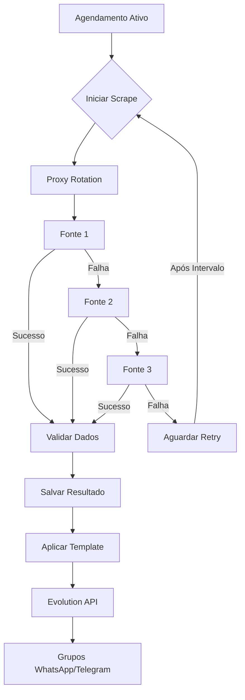

## 1. Product Overview
Sistema automatizado para coleta e distribuição de resultados do jogo do bicho através de scrape de múltiplas fontes online, com integração a WhatsApp e Telegram via Evolution API v2. O sistema permite agendamento configurável de coleta e envio, com interface web para gerenciamento completo.

- Resolve o problema de coleta manual de resultados e distribuição demorada
- Permite que administradores de grupos de jogo do bicho automatizem o envio de resultados
- Oferece templates personalizáveis e edição manual para correções

## 2. Core Features

### 2.1 User Roles
| Role | Registration Method | Core Permissions |
|------|-------------------|------------------|
| Admin Master | Email registration | Full system access, configuration global |
| Admin Grupo | Convite/Email | Gerenciar grupos, templates, agendamentos |
| Usuário Visualizador | Convite | Visualizar resultados, histórico |

### 2.2 Feature Module
Nosso sistema de scrape consiste nas seguintes páginas principais:
1. **Dashboard Principal**: Visão geral do sistema, estatísticas de scrape, status de integrações
2. **Configuração de Fontes**: Gerenciamento de URLs de scrape, teste de conexão, validação de dados
3. **Templates de Mensagens**: Editor de templates, variáveis dinâmicas, preview de mensagens
4. **Gerenciamento de Grupos**: Cadastro de grupos WhatsApp/Telegram, configuração de horários
5. **Agendamentos**: Calendário de coletas e envios, configuração de frequência
6. **Resultados**: Visualização de resultados coletados, edição manual, histórico
7. **Configurações do Sistema**: Proxy rotation, Evolution API, notificações
8. **Logs e Monitoramento**: Visualização de logs, erros, métricas de performance

### 2.3 Page Details
| Page Name | Module Name | Feature description |
|-----------|-------------|---------------------|
| Dashboard Principal | Visão Geral | Exibir total de resultados coletados hoje, grupos ativos, status de integrações, gráfico de atividade recente |
| Dashboard Principal | Alertas | Mostrar notificações de erros, bloqueios de proxy, falhas de scrape |
| Configuração de Fontes | Lista de Fontes | Adicionar/editar/remover URLs de fontes, definir prioridade de fontes, testar conectividade |
| Configuração de Fontes | Validadores | Configurar regex para extração de dados, mapear campos (data, hora, resultado, bicho) |
| Templates de Mensagens | Editor | Criar/editar templates com variáveis {data}, {hora}, {resultado}, {bicho}, preview em tempo real |
| Templates de Mensagens | Variáveis | Adicionar emojis, formatação personalizada, condicionais para diferentes resultados |
| Gerenciamento de Grupos | Grupos WhatsApp | Cadastrar ID de grupos, configurar horários de envio, selecionar templates |
| Gerenciamento de Grupos | Grupos Telegram | Cadastrar ID de canais/grupos, configurar horários de envio, selecionar templates |
| Agendamentos | Calendário | Visualizar calendário com coletas e envios agendados, arrastar para reagendar |
| Agendamentos | Frequência | Configurar intervalos (diário, semanal, personalizado), horários específicos |
| Resultados | Lista de Resultados | Visualizar resultados coletados por data, filtrar por tipo de jogo, exportar CSV |
| Resultados | Edição Manual | Editar resultados coletados, adicionar anotações, marcar como correto/erro |
| Configurações do Sistema | Evolution API | Configurar instância, tokens, testar conexão com WhatsApp/Telegram |
| Configurações do Sistema | Proxy Rotation | Adicionar lista de proxies, configurar rotação automática, testar proxies |
| Logs e Monitoramento | Logs de Sistema | Visualizar logs por data/hora, filtrar por tipo (erro, warning, info) |
| Logs e Monitoramento | Métricas | Exibir taxa de sucesso de scrape, tempo médio de coleta, grupos mais ativos |

## 3. Core Process

### Fluxo Principal do Sistema
1. Sistema verifica agendamentos ativos no banco de dados
2. Inicia processo de scrape nas fontes configuradas
3. Valida e processa dados extraídos
4. Salva resultados no banco de dados
5. Prepara mensagens baseadas em templates
6. Envia para grupos configurados via Evolution API
7. Registra logs e métricas de performance

### Fluxo de Tratamento de Erros
1. Detecta falha no scrape (proxy bloqueado, site fora do ar)
2. Tenta próxima fonte por ordem de prioridade
3. Se todas falharem, aguarda intervalo e tenta novamente
4. Notifica administrador via painel e email
5. Registra erro para análise posterior

## 4. User Interface Design

### 4.1 Design Style
- **Cores Primárias**: Verde (#28a745) - referência ao jogo do bicho
- **Cores Secundárias**: Branco (#ffffff), Cinza Claro (#f8f9fa)
- **Botões**: Estilo arredondado com hover effects
- **Fonte**: Inter ou Roboto, tamanhos 14px para texto, 16px para headers
- **Layout**: Card-based com navegação lateral
- **Ícones**: Bootstrap Icons ou Feather Icons

### 4.2 Page Design Overview
| Page Name | Module Name | UI Elements |
|-----------|-------------|-------------|
| Dashboard Principal | Visão Geral | Cards com números destacados em verde, gráfico de barras para atividade, lista de alertas em vermelho |
| Configuração de Fontes | Lista de Fontes | Tabela com status (online/offline), botão testar com spinner de loading, indicador de prioridade |
| Templates de Mensagens | Editor | Editor de texto com toolbar, preview lado a lado, variáveis destacadas em azul |
| Gerenciamento de Grupos | Grupos | Lista com avatar do grupo, status de último envio, toggle switch para ativar/desativar |
| Resultados | Lista | Tabela responsiva com paginação, badge de status (coletado/editado), botões de ação compactos |

### 4.3 Responsiveness
- Desktop-first com breakpoints para tablet (768px) e mobile (480px)
- Navegação lateral colapsa em hamburger menu no mobile
- Tabelas horizontal scroll em telas pequenas
- Touch optimization para botões e formulários